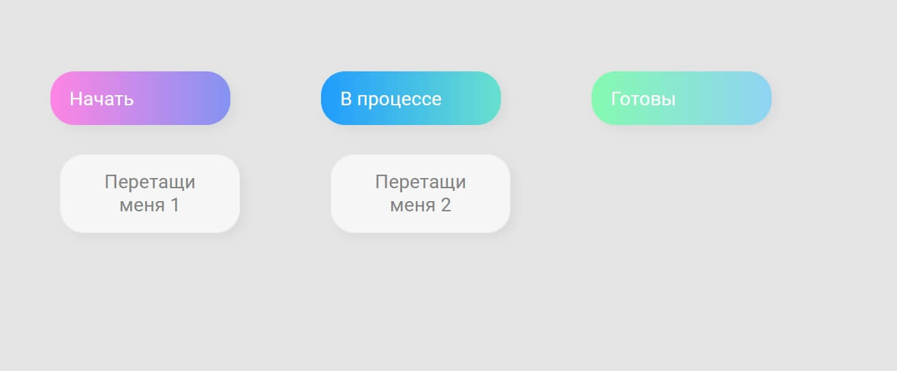
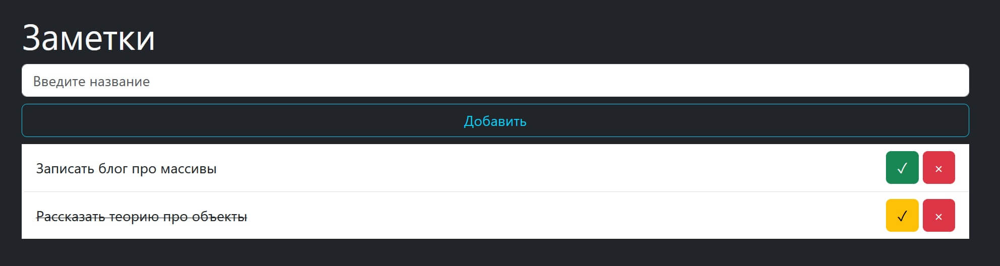
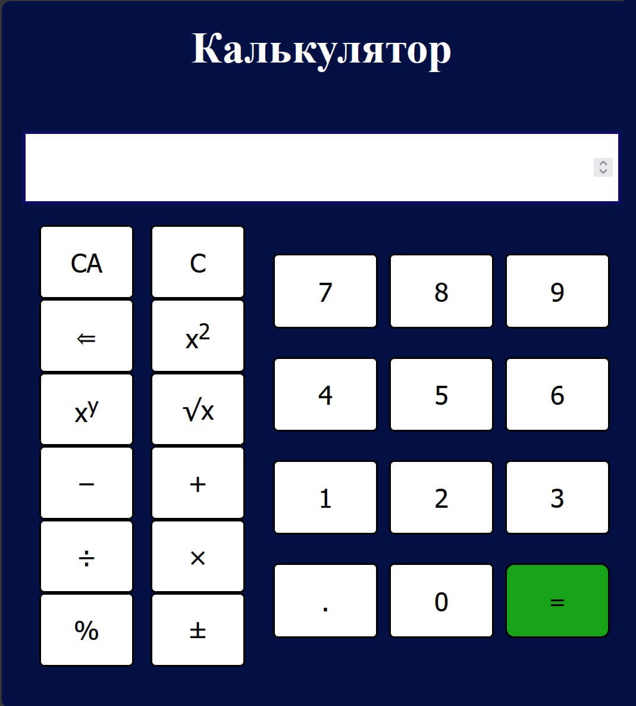
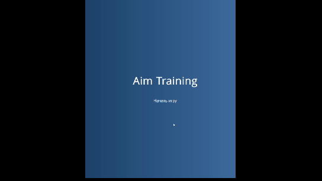
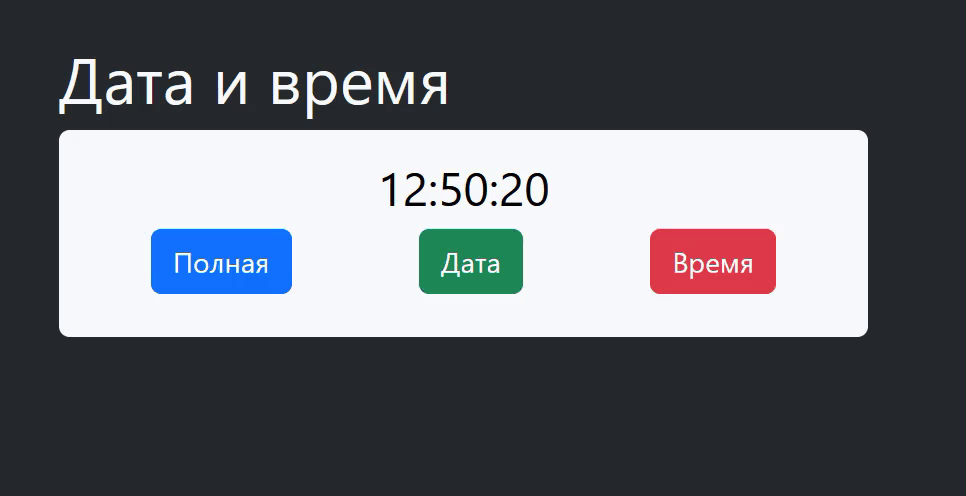
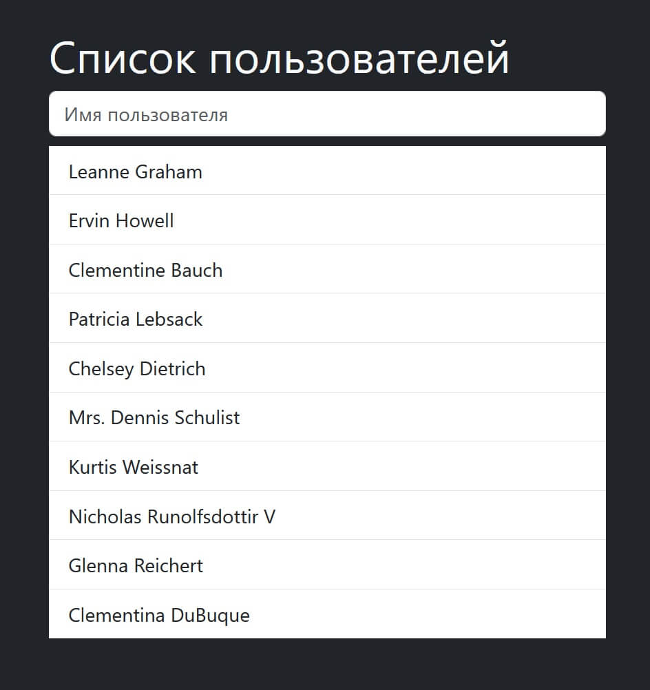

# JavaScript educational projects

## [Галлерея из карточек с картинками](cards-gallery)

## [Достка с задачами](kanbanboard)

## [Блокнот](notepad)

Добавление в список заметок новых записей. Возможность удалить заметку, отметить выполненной или исправить отметку "выполненно" на "новая".

## [Слайдер картинок](pictures-slider)

## [Простой калькулятор](simple-calculator)

## [Aim training game](games/aim-training-game)

Игра для тренировки попадания мышкой по нужным точкам на экране.

## [Доска с разноцветными точками](games/board-with-colored-dots)

Поле с серыми маленькими квадратиками, при наведении мышкой на которые, окрашиваются в случайные разноцветные цвета.

## [Часы](clock)

## [Список пользоватлей](async-getting-data)

Асинхронная загрузка списка пользователей и поиск по нему.

